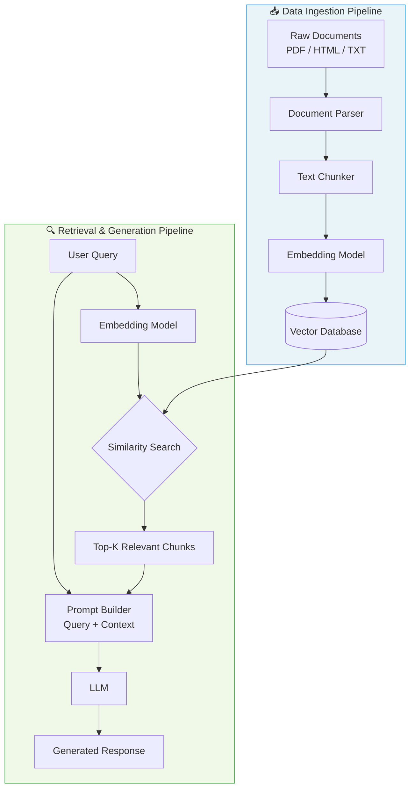

# Introduction to RAG (Retrieval-Augmented Generation)

## Core Problem: Why Use RAG?

Standard Large Language Models (LLMs) suffer from two significant limitations that RAG aims to solve:

- **Hallucination**: LLMs are limited by their training cutoff dates and may generate incorrect information about events that occurred after their training.
- **Lack of Domain-Specific Knowledge**: Fine-tuning models on proprietary or internal data (like HR or finance policies) is prohibitively expensive and time-consuming.

---

## How RAG Works

RAG optimizes LLM outputs by referencing an authoritative, external knowledge base. It operates across two primary pipelines:

### 1. Data Ingestion Pipeline
Involves parsing unstructured data (PDFs, HTML, etc.), chunking it into smaller segments, converting those chunks into embeddings (numerical representations), and storing them in a vector database.

### 2. Retrieval Pipeline
When a user submits a query, the system performs a similarity search within the vector database to retrieve relevant context. This context is then sent to the LLM alongside the user's prompt to generate an accurate, informed response.

---

## RAG Architecture Diagram

---

## Key Components

| Component | Role |
|---|---|
| **Document Parser** | Extracts text from raw files (PDF, HTML, DOCX) |
| **Text Chunker** | Splits documents into manageable segments |
| **Embedding Model** | Converts text chunks into numerical vectors |
| **Vector Database** | Stores and indexes embeddings for fast similarity search |
| **LLM** | Generates a final response using retrieved context |

---

## Future Outlook

RAG is a highly sought-after skill in the industry, with a significant percentage of modern AI projects relying on it. Practical implementations include modular coding, building projects using various file formats, and experimenting with different chunking strategies.
