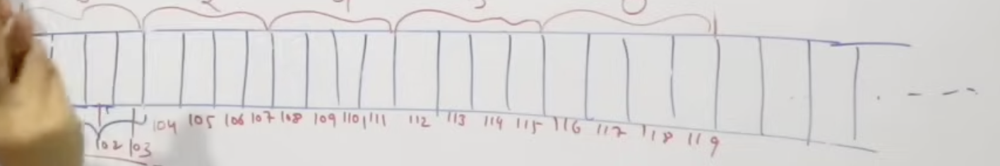

Arrays are fixed in length they stores in continous memory loation. Array follow the random access you can access any element in the array by its index 



The Need for Arrays: Standard variables can only store one value at a time. Arrays solve the problem of managing large collections of related data (like test scores for 60 students) under a single variable name.

Definition & Declaration: An array is a collection of data items of the same data type stored in consecutive memory locations. The video emphasizes that the array size must be a constant value when declared.

Initialization: Arrays can be initialized at compile time (providing values during declaration) or at runtime (using loops and functions like scanf to get input from the user).

Memory Representation: Arrays are stored in consecutive (contiguous) memory locations.
Accessing Data: The video explains that arrays support random access. Because elements are stored contiguously, any element can be accessed in constant time (O(1)) using the formula: Base Address + (index * size_of_data_type).
An Array address is hexa decimal numbers.

Indexing: Array indexing typically starts at 0

Important Considerations:
Fixed Size: A significant limitation is that the array size is fixed at compile time and cannot be resized during execution.
Homogeneity: All elements must be of the same data type (8:46).
Performance: While random access is highly efficient, space wastage can occur if an array is declared larger than the amount of data actually stored

Array does not have a bound checking property the developer responsibility to check the boundry of an Array.`
---

## Examples

### Declaration & Initialization

**Compile-time initialization** (values provided at declaration):

```java
// Fixed size, all elements defined upfront
int[] scores = {85, 92, 78, 90, 88};

// Declare with size, elements default to 0
int[] grades = new int[5];
```

**Runtime initialization** (values filled during execution):

```java
import java.util.Scanner;

Scanner sc = new Scanner(System.in);
int[] scores = new int[5];

for (int i = 0; i < scores.length; i++) {
    System.out.print("Enter score " + (i + 1) + ": ");
    scores[i] = sc.nextInt();
}
```

---

### Accessing Elements by Index (Random Access)

Array indexing starts at 0. Any element can be accessed in **O(1)** constant time:

```java
int[] scores = {85, 92, 78, 90, 88};

System.out.println(scores[0]); // 85  → index 0 (first element)
System.out.println(scores[2]); // 78  → index 2
System.out.println(scores[4]); // 88  → index 4 (last element)
```

---

### Memory Address Calculation

Formula: `Base Address + (index × size_of_data_type)`

```
Array: int[] scores = {85, 92, 78, 90, 88}
Base address (hex): 0x100
Size of int: 4 bytes

scores[0] → 0x100 + (0 × 4) = 0x100
scores[1] → 0x100 + (1 × 4) = 0x104
scores[2] → 0x100 + (2 × 4) = 0x108
scores[3] → 0x100 + (3 × 4) = 0x10C
scores[4] → 0x100 + (4 × 4) = 0x110
```

---

### Iterating Over an Array

```java
int[] scores = {85, 92, 78, 90, 88};

// Using a standard for loop
for (int i = 0; i < scores.length; i++) {
    System.out.println("Index " + i + ": " + scores[i]);
}

// Using an enhanced for loop
for (int score : scores) {
    System.out.println(score);
}
```

---

### Fixed Size Limitation

Once declared, the size cannot change. If you need more space, you must create a new array:

```java
int[] original = {1, 2, 3};           // size 3, no room to grow

// Create a larger array and copy elements manually
int[] resized = new int[6];
for (int i = 0; i < original.length; i++) {
    resized[i] = original[i];
}
// Or use the built-in helper:
int[] resized2 = java.util.Arrays.copyOf(original, 6);
```

---

### Homogeneous Data Type

All elements must be the same type:

```java
int[]    numbers = {1, 2, 3};          // only ints
double[] prices  = {9.99, 4.50, 12.0}; // only doubles
String[] names   = {"Alice", "Bob"};    // only Strings

// This would cause a compile error:
// int[] mixed = {1, "hello", 3.14};
```

### Ponters:

Pointer stores memory address of another variables

For ex int a * p

so p will store the memory address of int a.