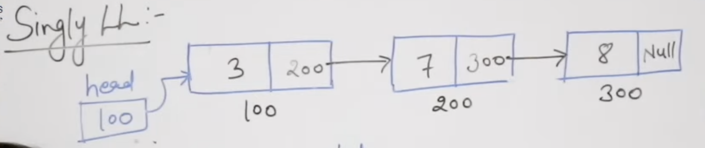
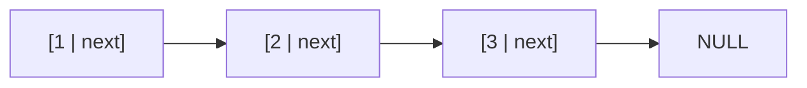
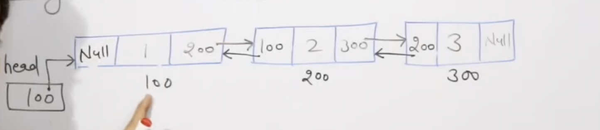
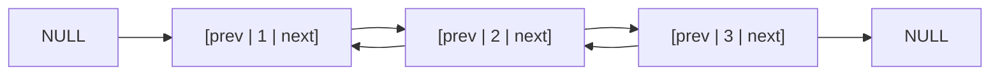
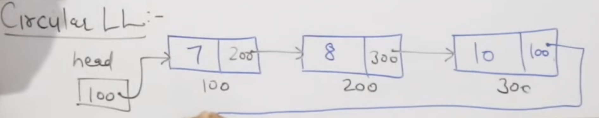
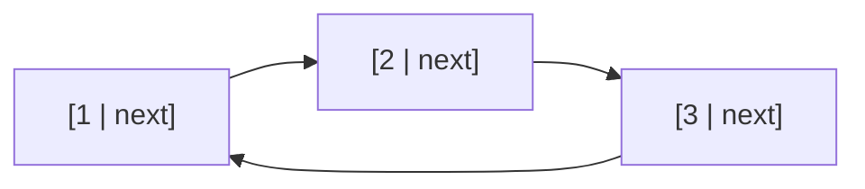
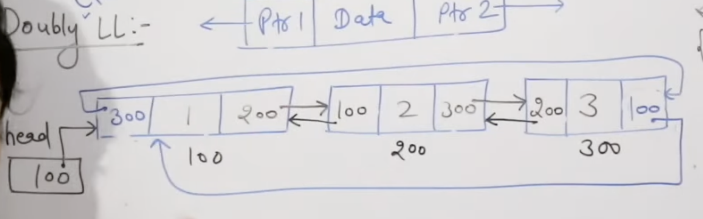
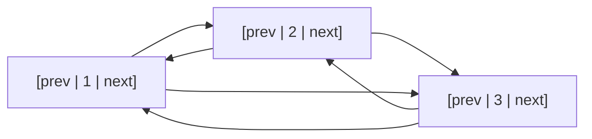

**Limitations of Arrays:** Arrays require a fixed size determined at compile time and consume contiguous memory blocks. This leads to issues where memory cannot be easily extended if the programmer underestimates the required space, or it results in significant memory wastage if space is pre-allocated but not fully used.

**The Linked List Solution:** A linked list is a linear data structure where elements are stored in non-consecutive (scattered) memory locations. Each element is contained within a node, which stores the data and a pointer to the address of the next node.

### Operations and Complexity 

**Flexibility:** Inserting and deleting elements is much easier in a linked list than in an array because nodes do not need to be contiguous .

**Accessing Data:** Unlike arrays, which allow constant-time (O(1)) random access, linked lists require sequential traversal, resulting in O(n) time complexity for accessing elements.

**Memory Overhead:** Linked lists require extra space to store the address pointers for each node.

### Type of linked List

1. **Singly Linked List:** The simplest form where each node contains data and a pointer to the next node. The last node points to null, indicating the end of the list.


```
[data|next] --> [data|next] --> [data|next] --> NULL
   Node 1           Node 2           Node 3
```



2. **Doubly Linked List:** Each node contains data and two pointers: one pointing to the next node and another pointing to the previous node, allowing for bidirectional traversal.



```
NULL <-- [prev|data|next] <--> [prev|data|next] <--> [prev|data|next] --> NULL
              Node 1                 Node 2                 Node 3
```



3. **Circular Linked List:** A variation of the singly linked list where the last node does not point to null, but instead points back to the first node, forming a circle.



```
 ┌─────────────────────────────────────┐
 ↓                                     │
[data|next] --> [data|next] --> [data|next]
   Node 1           Node 2         Node 3
```



4. **Doubly Circular Linked List:** Combines features of both doubly and circular linked lists. The last node points to the first node, and the first node points back to the last node, allowing complete circular navigation in both directions.



```
 ┌──────────────────────────────────────────────┐
 │  ┌───────────────────────────────────────┐   │
 ↓  ↑                                       ↓   ↑
[prev|1|next] <--> [prev|2|next] <--> [prev|3|next]
     Node 1              Node 2             Node 3
```

