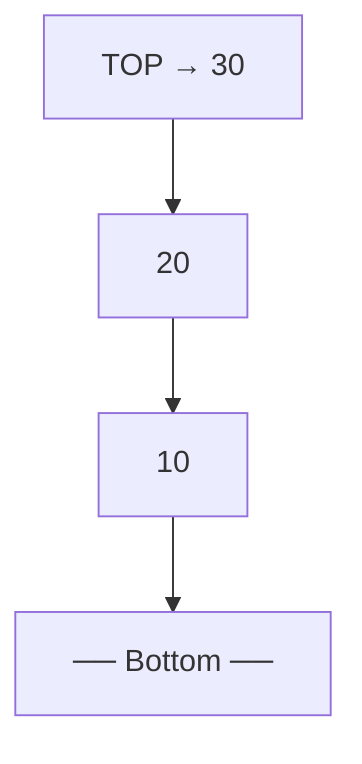

### What is a Stack?

A stack is a linear data structure that acts as an ordered container.
It follows a strict rule for operations: data can only be inserted and deleted from one end, known as the top.
This follows the LIFO (Last-In, First-Out) or FILO (First-In, Last-Out) principle, similar to a stack of plates or a CD stand.

### Fundamental Operations

Push: Inserting an element into the stack.
Pop: Removing the topmost element from the stack.
Peek/Top: Accessing the topmost element without removing it.
Is Empty / Is Full: Functions used to check the state of the stack.

### Stack Implementation

1. Stack can be implemented using Arrays or Linked List.

---

## Visual Representation

```
Push 10 → Push 20 → Push 30

     [ 30 ]  ← TOP
     [ 20 ]
     [ 10 ]
    ─────────
     Stack
```

Pop removes from the top first (30 → 20 → 10):

```
After Pop:

     [ 20 ]  ← TOP
     [ 10 ]
    ─────────
```



---

### Stack Using Array (Manual Implementation)

```java
class Stack {
    int[] arr;
    int top;
    int size;

    Stack(int size) {
        this.size = size;
        arr = new int[size];
        top = -1;               // -1 means empty
    }

    void push(int val) {
        if (top == size - 1) {
            System.out.println("Stack Overflow!");
            return;
        }
        arr[++top] = val;
    }

    int pop() {
        if (top == -1) {
            System.out.println("Stack Underflow!");
            return -1;
        }
        return arr[top--];
    }

    int peek() {
        return arr[top];
    }

    boolean isEmpty() {
        return top == -1;
    }
}

// Usage
Stack s = new Stack(5);
s.push(10);
s.push(20);
s.push(30);
System.out.println(s.peek());  // 30
System.out.println(s.pop());   // 30
System.out.println(s.pop());   // 20
```

---

---

### Stack Using Linked List

Each node holds data and a pointer to the next node. The `top` pointer always tracks the most recently pushed node. New elements are prepended (pushed to front), and removed from the front on pop — giving O(1) push/pop with no fixed size limit.

```
Push 10 → Push 20 → Push 30

top → [30 | next] → [20 | next] → [10 | null]
```

```java
public class StackUsingLinkedList {

    public LinkedList linkedList;
    public LinkedList.Node top;

    public StackUsingLinkedList() {
        linkedList = new LinkedList();
    }

    // Prepend new node before current top
    public void push(int data) {
        LinkedList.Node newNode = new LinkedList.Node(data);
        if (linkedList.head == null) {
            linkedList.head = newNode;
            top = linkedList.head;
        } else {
            newNode.next = this.top;
            this.top = newNode;
        }
    }

    // Move top pointer to next node
    public void pop() {
        top = top.next;
    }

    // Print top element without removing
    public void peek() {
        System.out.println(top.data);
    }

    // Traverse from top to bottom and print all elements
    public void printData() {
        LinkedList.Node temp = top;
        while (temp != null) {
            System.out.println(temp.data);
            temp = temp.next;
        }
    }
}
```

**Key differences vs Array-based stack:**

| | Array Stack | Linked List Stack |
|---|---|---|
| Size | Fixed at creation | Dynamic (grows as needed) |
| Memory | Contiguous block | Scattered nodes with pointers |
| Overflow | Possible | Not possible (heap limit only) |
| Extra memory | None | Pointer per node |

---

## Time Complexity

| Operation | Complexity | Notes |
|---|---|---|
| Push | O(1) | Always inserts at the top |
| Pop | O(1) | Always removes from the top |
| Peek / Top | O(1) | Reads top without traversal |
| Search | O(n) | Must scan from top to bottom |
| isEmpty | O(1) | Checks a single flag or index |
