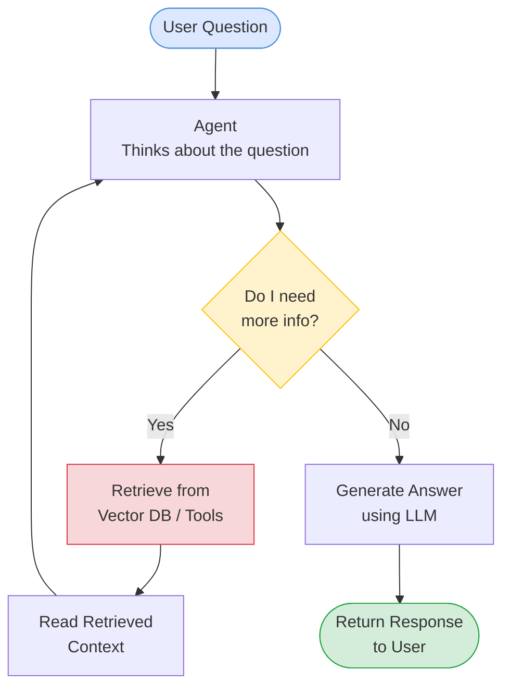
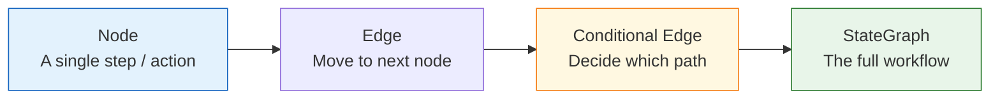
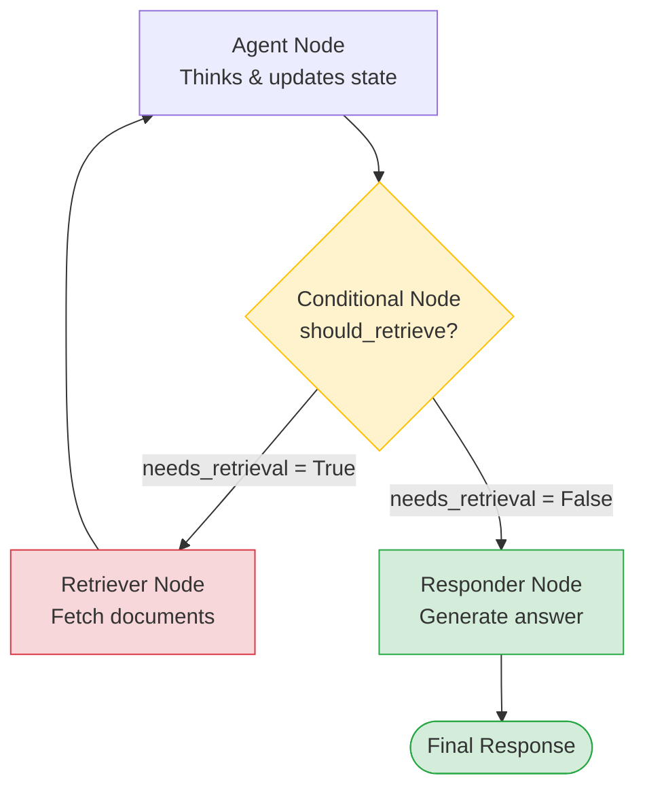

# Agentic Workflows with LangGraph

## What is an Agentic Workflow?

A normal LLM just answers one question at a time. An **agentic workflow** lets an AI make decisions, take actions, and loop back — like a real assistant solving a multi-step problem.

> **Simple analogy**: Think of it like a GPS. It doesn't just give you one direction — it watches the road, re-routes if you miss a turn, and keeps guiding until you arrive.

---

## Why LangGraph?

LangGraph lets you build these multi-step AI workflows as a **graph** — a set of nodes (steps) connected by edges (decisions).

| Feature | What it means in plain English |
|---|---|
| **Complex Workflow Design** | Your AI can follow different paths depending on the situation — not just a straight line |
| **State Management** | The agent remembers things as it works (e.g., your question, documents it found, what it decided) |
| **Conditional Logic** | At each step, the agent can ask "what should I do next?" and branch accordingly |
| **Control & Observability** | You can see exactly what the agent did and why — great for debugging |

---

## Simple Example: Question-Answering Agent

Imagine you ask: **"What is the refund policy?"**

The agent needs to decide:
- Do I already know the answer? → Reply directly
- Do I need to look it up? → Search the database first, then reply

### Without LangGraph (static pipeline)
Every question goes through the same steps, even when unnecessary. Wasteful and inflexible.

### With LangGraph (agentic)
The agent checks what it needs and takes the right path — dynamically.

---

## Agentic Workflow Diagram



> The agent loops back to think again after retrieving info — this is what makes it **agentic** (self-directing).

---

## How State Works

LangGraph tracks a **state object** throughout the workflow. Think of it as a shared notepad the agent updates at each step.

```python
# Example state definition
class AgentState(TypedDict):
    question: str          # What the user asked
    documents: list        # Retrieved context (if any)
    answer: str            # Final answer
    needs_retrieval: bool  # Agent's decision flag
```

At each node, the agent can read from and write to this state — so every step knows what happened before.

---

## Key LangGraph Concepts at a Glance



- **Node** — a function that does one thing (call LLM, search DB, format output)
- **Edge** — connects two nodes; can be fixed or conditional
- **StateGraph** — the container that holds all nodes and edges together

---

## Conditional Nodes (Decision Points)

A **conditional node** is the brain of the agent — it looks at the current state and decides which path to take next.

> **Simple analogy**: Like a traffic light at an intersection — depending on the situation, it tells the agent to go left, right, or stop.

### Key Points

- **Reads from state** — it doesn't do any heavy work itself; it just inspects what's already in the state (e.g., was a document found? did the LLM say it needs more info?)
- **Returns a route name** — it returns a string like `"retrieve"` or `"respond"` that tells LangGraph which node to go to next
- **Keeps nodes clean** — by separating decision logic from action logic, each node stays focused on one job
- **Enables loops** — a conditional node can send the agent back to a previous node to retry or gather more information
- **Multiple branches** — a single conditional node can route to 2, 3, or more different nodes depending on the situation

### Example

```python
def should_retrieve(state: AgentState) -> str:
    # If the agent flagged it needs more info, go retrieve
    if state["needs_retrieval"]:
        return "retrieve"
    # Otherwise, go straight to generating the answer
    return "respond"

# Wire it into the graph
graph.add_conditional_edges("agent", should_retrieve, {
    "retrieve": "retriever_node",
    "respond": "responder_node",
})
```

### Conditional Node Flow



---

## Summary

LangGraph is ideal when your AI needs to:

- **Make decisions** at runtime (not just follow a fixed script)
- **Loop or retry** steps based on what it finds
- **Remember context** across multiple steps
- **Be transparent** — you can trace every decision the agent made
